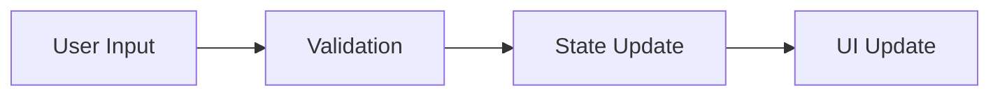
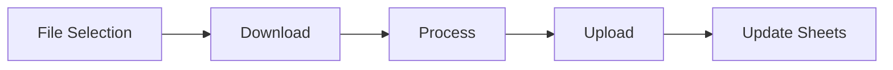
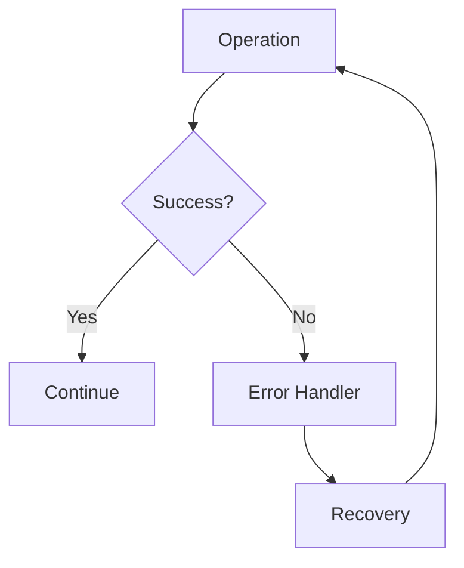

# Gmail PDF Attachment Processor - Detailed Documentation

Composed with Cursor - Use with Discretion. AI hallucinations and potential errors are possible.

## Table of Contents
1. [Overview](#overview)
2. [System Architecture](#system-architecture)
3. [Core Features](#core-features)
4. [Technical Implementation](#technical-implementation)
5. [Security and Error Handling](#security-and-error-handling)
6. [User Interface](#user-interface)
7. [Data Flow](#data-flow)
8. [Setup and Dependencies](#setup-and-dependencies)
9. [License](#license)

## Overview

### Purpose
The Gmail PDF Attachment Processor is a secure application designed to:
- Search Gmail for PDF attachments using specific keywords
- Process password-protected PDFs
- Organize files in Google Drive
- Extract transaction data
- Create organized Google Sheets with the extracted data

### Key Benefits
- Automated email searching and PDF processing
- Secure handling of sensitive documents
- Organized file storage with custom folder structure
- Automated transaction data extraction
- Clear data presentation in Google Sheets

## System Architecture

### Components
1. **Frontend Layer**
   - Streamlit-based web interface
   - Interactive UI elements
   - Real-time feedback system

2. **Service Layer**
   - Gmail Handler: Email search and attachment download
   - Drive Handler: File storage and organization
   - PDF Handler: PDF processing and data extraction
   - Sheets Handler: Transaction data management

3. **Security Layer**
   - OAuth 2.0 authentication
   - Session management
   - Secure password handling
   - Activity logging

### Data Flow Architecture
```
User Input → Authentication → Gmail Search → PDF Processing → Drive Storage → Sheets Update
```

## Core Features

### 1. Email Search System
- **Keyword-Based Search**
  - Multiple keyword support
  - Case-insensitive matching
  - Subject and content search
  - Attachment type filtering

- **Result Organization**
  - Grouping by keywords
  - Sender-based organization
  - Date-based sorting
  - Size information display

### 2. PDF Processing
- **Password Handling**
  - Multiple password attempts
  - Password caching
  - Group-based password application
  - Password hint support

- **File Processing**
  - Password removal
  - Data extraction
  - Format standardization
  - Error recovery

### 3. File Organization
- **Folder Structure**
  ```
  Main Folder/
  ├── Keyword1/
  │   ├── file1.pdf
  │   └── file2.pdf
  ├── Keyword2/
  │   └── file3.pdf
  └── Content_matches/
      └── file4.pdf
  ```

- **Naming Convention**
  - Date-based prefixes
  - Original filename preservation
  - Duplicate handling
  - Special character handling

### 4. Transaction Management
- **Data Extraction**
  - Transaction date
  - Description
  - Amount
  - Category

- **Sheet Organization**
  - Separate sheets per keyword
  - Formatted headers
  - Visual separators
  - Auto-sizing columns

## Technical Implementation

### Authentication System
```python
def initialize_handlers():
    """
    1. Create Gmail handler
    2. Authenticate user
    3. Initialize Drive and Sheets handlers
    4. Create secure session
    5. Log authentication
    """
```

### PDF Processing Logic
```python
def process_pdf_batch(attachments, folder_id, current_keyword, passwords, processed_files):
    """
    For each attachment:
    1. Check if already processed
    2. Download attachment
    3. Try passwords if needed
    4. Process PDF and extract data
    5. Upload to Drive
    6. Update sheets
    7. Log activity
    """
```

### Error Handling Strategy
1. **Graceful Degradation**
   - Partial success handling
   - Continued processing after errors
   - User feedback for failures

2. **Recovery Mechanisms**
   - Retry logic for failed operations
   - Password retry system
   - Session recovery

### State Management
```python
# Session State Variables
- auth_completed
- gmail_handler
- drive_handler
- sheets_handler
- selected_attachments
- processing_status
- results_cache
```

## Security and Error Handling

### Security Measures
1. **Authentication**
   - OAuth 2.0 protocol
   - Token management
   - Session timeouts
   - Secure credential storage

2. **Data Protection**
   - No password storage
   - Secure file handling
   - Temporary file cleanup
   - Access control

3. **Activity Logging**
   - User actions
   - System operations
   - Error tracking
   - Security events

### Error Handling
1. **User Input Validation**
   - Input sanitization
   - Format verification
   - Size limits
   - Type checking

2. **Operation Recovery**
   - Automatic retries
   - Fallback options
   - State preservation
   - Error reporting

## User Interface

### Main Components
1. **Authentication Section**
   - Sign-in button
   - Status display
   - Error messages

2. **Configuration Section**
   - Main folder name input
   - Search keywords input
   - Password list input
   - Help text

3. **Results Display**
   - File selection tables
   - Group organization
   - Processing status
   - Success/error messages

### Interactive Elements
1. **Selection Controls**
   - Select/Deselect all
   - Individual file selection
   - Group-based selection

2. **Processing Controls**
   - Search button
   - Process button
   - Password retry
   - Cancel operation

## Data Flow

### 1. Input Processing


### 2. File Processing


### 3. Error Handling


## Setup and Dependencies

### Required Packages
```
google-auth-oauthlib
google-auth-httplib2
google-api-python-client
PyPDF2
pandas
streamlit
python-dateutil
pytz
```

### Configuration Files
1. **credentials.json**
   - Google Cloud project credentials
   - API access configuration
   - OAuth 2.0 settings

2. **.streamlit/config.toml**
   ```toml
   [browser]
   gatherUsageStats = false
   
   [theme]
   primaryColor = "#FF4B4B"
   backgroundColor = "#FFFFFF"
   secondaryBackgroundColor = "#F0F2F6"
   textColor = "#262730"
   font = "sans serif"
   ```

### Environment Setup
1. Create virtual environment
2. Install dependencies
3. Configure Google Cloud project
4. Set up API access
5. Configure security settings

## License
This project is licensed under the Creative Commons Attribution-NonCommercial-ShareAlike 4.0 International License (CC BY-SA NC 4.0).

### Usage Terms
- Attribution required
- Non-commercial use only
- Share-alike requirement
- No warranty provided

---

## Implementation Notes

### Critical Considerations
1. **Performance**
   - Batch processing
   - Caching strategies
   - Memory management
   - Async operations

2. **Scalability**
   - Modular design
   - Service separation
   - Resource management
   - Error isolation

3. **Maintenance**
   - Code documentation
   - Error logging
   - Version control
   - Update mechanism

### Best Practices
1. **Code Organization**
   - Separation of concerns
   - Clear naming conventions
   - Consistent formatting
   - Comprehensive comments

2. **Testing Strategy**
   - Unit tests
   - Integration tests
   - Error scenario testing
   - Performance testing

3. **Documentation**
   - Code comments
   - API documentation
   - User guides
   - Troubleshooting guides 